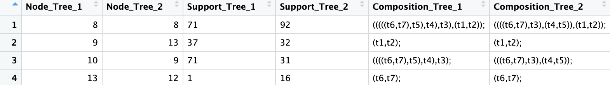
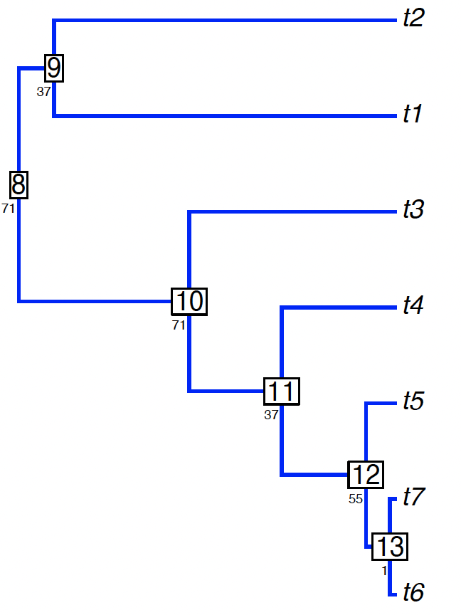
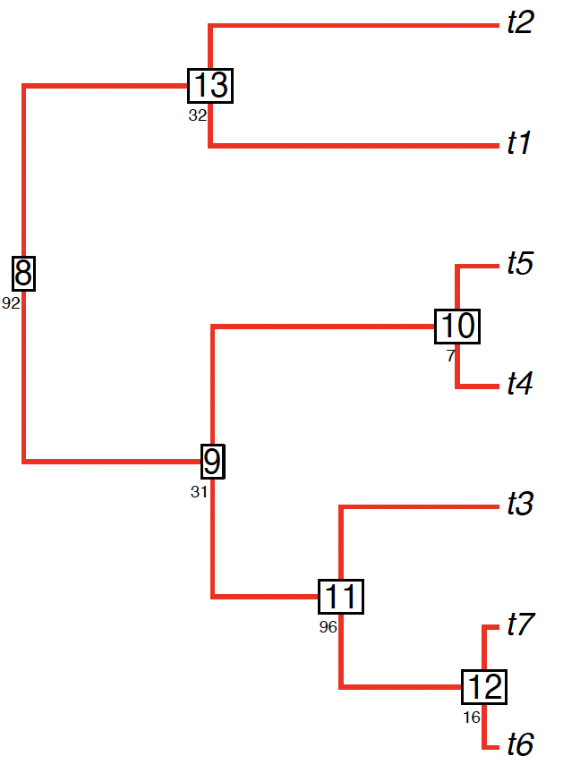
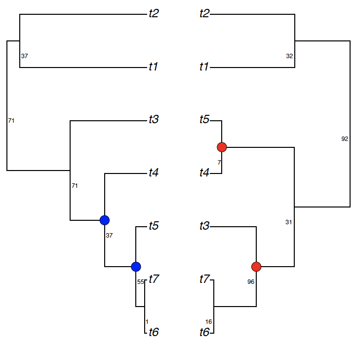
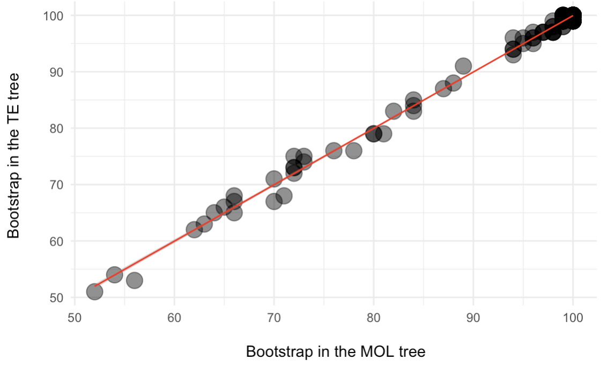
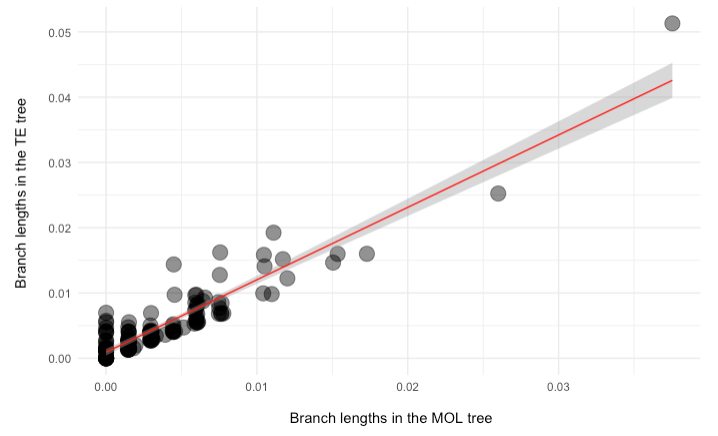

```{r, include = FALSE}
knitr::opts_chunk$set(
  collapse = TRUE,
  comment = "#>"
)
```

## Identify shared and unique clades

Using simple simulations, we can demonstrate how to compare support values between trees. We first simulate two trees containing support values: 

```r
library(phytools)
set.seed(44)
# Simulate tree a
a = pbtree(n=7) 
# Generate random support values as integers to tree a
node_labels = sample(1:100, a$Nnode, replace = TRUE) 
# Add the support values as node labels to tree a
a$node.label = node_labels 

set.seed(88)
# Simulate tree b
b = pbtree(n=7)
# Generate random support values as integers to tree b
node_labels = sample(1:100, b$Nnode, replace = TRUE) 
# Add the support values as node labels to tree b
b$node.label = node_labels 
```

Next, we run `sharedNodes` to identify matching clades and their descendants and support values. Additionally, we also can plot the trees.

```r
library(RNODE)
# Compare shared clades and support values (and plot)
df = sharedNodes(tree1=a, tree2=b, composition=T, 
                 plotTrees = T,
                 output.tree1="example1.1_simulated1.pdf",
                 output.tree2="example1.1_simulated2.pdf", 
                 tree.width = 3, # adjust tree width
                 tree.height = 4, # adjust tree height
                 tree.fsize = 1, # adjust font size
                 tree.adj=c(1.2,3), # adjust support position
                 tree.cex=.5, # adjust support size
                 node.numbers=T) # show node index
```

<p align="center">
  
</p>

<p align="center">
  
  
</p>

Alternatively, we can identify and plot the unique clades:

```r
uniqueNodes(a, b, composition=T, dataframe=T,
            plotTrees=T, output.tree = "example1.1_unique.pdf",
            node.numbers=T, 
            tree.fsize=2, # adjust text size
            tree.cex=7.5, # adjust circle size
            sup.adj1=c(-.2,4), # adjust support from tree a
            sup.adj2=c(1.3,4) # adjust support from tree b
            )
```

<p align="center">
  
</p>

## Support comparisons

We can use `sharedNodes` to compare two empirical trees in .nwk format estimated in TNT. Polytomies and input trees with different taxon samples are accepted but names of corresponding leaves should be equal in the input trees. For instance, using the data set from Whitcher et al. (2025), we can plot the relationship of bootstrap values between molecular (MOL) and total evidence (TE) trees analyzed in TNT.

```r
library(ggplot2)
# Load trees
MOL = read.tree("../testdata/051b_MOL_BS_TNT.nwk")
TE = read.tree("../testdata/051d_TE_BS_TNT.nwk")

# Run sharedNodes
df = sharedNodes(tree1=MOL, tree2=TE, spearman = T)

# Plot the relationship of support between trees
ggplot(df, aes(as.numeric(Support_Tree_1), as.numeric(Support_Tree_2))) +
  geom_point(size = 5, show.legend = F, alpha=.5) +
  theme_minimal() + 
  geom_smooth(method = "lm", se = T, color = "red", linewidth = .5) +
  labs(x="\n Bootstrap in the MOL tree",
       y="Bootstrap in the TE tree \n")
```

<p align="center">
  
</p>

As expected, there is a significant correlation between bootstrap values of MOL and TE trees (Spearman: rho = 0.89; P < 0.001). 

## Logistic regressions

If the user wants to test if support values of one tree predict the occurrence of clades in another tree, the function `retrodictNodes` creates a dataframe containing support values of tree 1 and the occurrence of the clade in tree 2, which can be used for logistic regressions.

```r
# Load trees
MOL = read.tree("../testdata/001_MOL_IQTREE.contree")
TE = read.tree("../testdata/001_TE_ASC_IQTREE.contree")

# Run retrodictNodes
df = retrodictNodes(MOL, TE)
df$occurrence_tree2 = as.factor(df$occurrence_tree2)

# Fit the logistic regression
model <- glm(occurrence_tree2 ~ support_tree1, data = df, family = binomial)
summary(model)

# Convert log-odds to odd ratios
exp(coef(model))
```

Using the data set from Janssens et al. (2018), the logistic regression revealed an intercept of 0.009 (i.e. when bootstrap is 0 in the first tree, the odds of presence of the clade in the second tree is 0.009; P < 0.01). Furthermore, for every one-unit increase in bootstrap in the first tree, the odds of presence of the clade in the second tree increase by 1.075 (7.5%). 

## Branch length comparisons

In addition to descendants and support values, branch lengths can be compared. 

```r
# Compare branch lengths
RNODE::compareBranchLength(MOL, TE, composition=T)

# Correlation between branch lengths
summary(lm(data=df, formula=EdgeLength_tree1 ~ EdgeLength_tree2))

# Plot 
ggplot(df, aes(as.numeric(EdgeLength_tree1), as.numeric(EdgeLength_tree2))) +
  geom_point(size = 5, show.legend = F, alpha=.5) +
  theme_minimal() + 
  geom_smooth(method = "lm", se = T, color = "red", linewidth = .5) +
  labs(x="\n Branch lengths in the MOL tree",
       y="Branch lengths in the TE tree \n")
```

<p align="center">
  
</p>

As expected, there is a significant correlation between bootstrap values of MOL and TE trees (linear model: estimate = 0.78; R-squared = 0.86; P < 0.001).

## Topological distances

In addition to comparisons between shared clades, support values and branch lengths, a popular method to compare phylogenies is based on topological metrics. Popular metrics like Robinson-Foulds and Cluster Information distances can be summarized using `summaryTopologicalDist`. Moreover, a common topological metric is the number of SPR moves to edit one tree into another tree. However, implementations are lacking in R to normalize SPR distances using the refined upper bound from Ding et al. (2011) (`normalizedSPR`) and computing SPR distances for multiple trees (`multiSPR`). 

```r
# Read trees
mol = read.tree("../testdata/003_MOL_IQTREE.contree")
te = read.tree("../testdata/003_TE_ASC_IQTREE.contree")

# RF and CID
summaryTopologicalDist(mol, te)

# Normalized SPR
normalizedSPR(mol, te)
```

The normalized SPR is 0.1931574.
