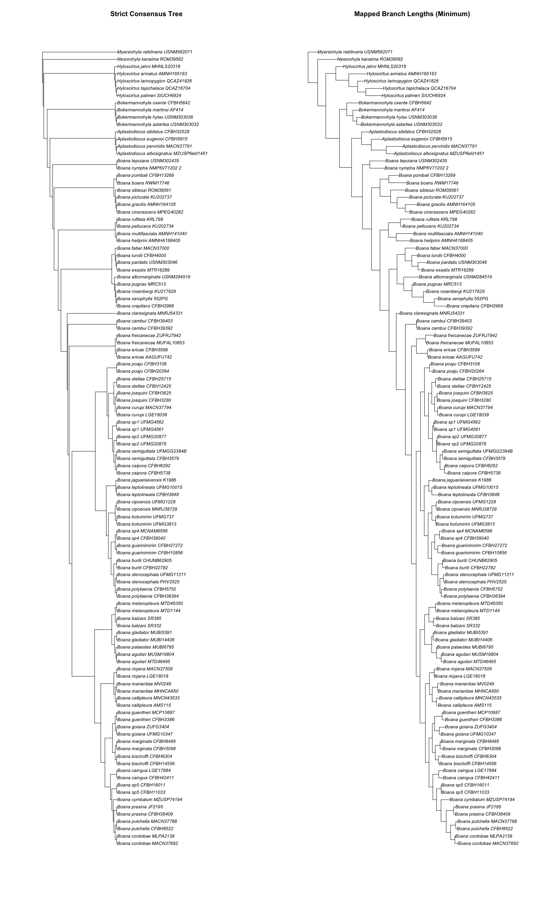

```{r, include = FALSE}
knitr::opts_chunk$set(
  collapse = TRUE,
  comment = "#>"
)
```

## Mapping support

Given a tree A without support values (e.g. strict consensus of optimal trees) and a tree B with support values (e.g. majority consensus from bootstrap pseudo-replicates), `mapSupport` returns the tree A with support values from shared clades with tree B. For instance, the strict consensus of optimal trees and the majority consensus tree from bootstrap trees share 223 clades, presenting 6 unique clades in the strict consensus and 1 unique clade in the bootstrap tree.  

```r
library(RNODE)
library(ape)

# Read trees
opt = read.tree("../testdata/051a_strictConsensus_MOL_TNT_results.nwk")
BS = read.tree("../testdata/051b_MOL_BS_TNT.nwk")

# Compute topological distances
summaryTopologicalDist(opt, BS)

# Map the BS values from the majority consensus tree to the optimal tree
opt_with_bs = mapSupport(opt, BS)
opt_with_bs[1]
```

## Mapping branch lengths

Finally, we can map branch lengths to the strict consensus either using the minimum values from a pool of MPTs or randomly selecting one of the MPTs. Using empirical data from Nakamura et al. 2025, we demonstrate the function `mapBranchLength`:

```r
strict = read.tree("../testdata/cymb_IP_GB.1.nwk")
mpts = read.tree("../testdata/cymb_IP_trees.nwk")

# Map using minimum branch length per shared edge
mapped_min <- mapBranchLength(strict, mpts, method = "minimum")

# Plot strict + mapped side by side
png("../man/figures/example4.2.png", width = 2400, height = 4000, res = 150)
par(mfrow = c(1, 2),            # 1 row, 2 columns
    mar = c(4, 4, 2, 2),        # margins
    oma = c(1, 1, 1, 1))        # outer margins
# Panel 1 — strict consensus
plot(ladderize(strict),
     main = "Strict Consensus Tree",
     cex = 0.8)
# Panel 2 — mapped branch lengths
plot(ladderize(mapped_min),
     main = "Mapped Branch Lengths (Minimum)",
     cex = 0.8)
dev.off()
```

<p align="center">
  
</p>
